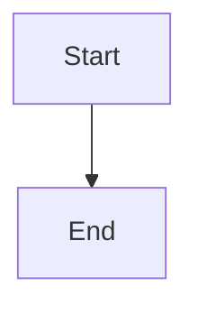
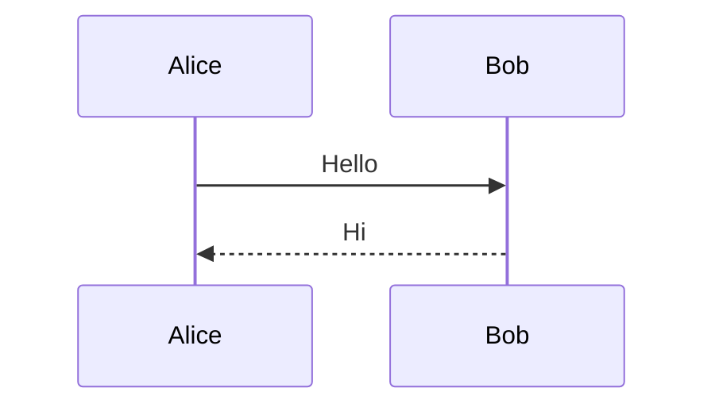

# Diagram guide

This page embeds diagrams rendered by `diagram markdown` (supports fenced `mermaid`, `plantuml`, and `dot` blocks).

## Flowchart



## Sequence



Regular code is left alone:

```rust
fn main() {}
```
